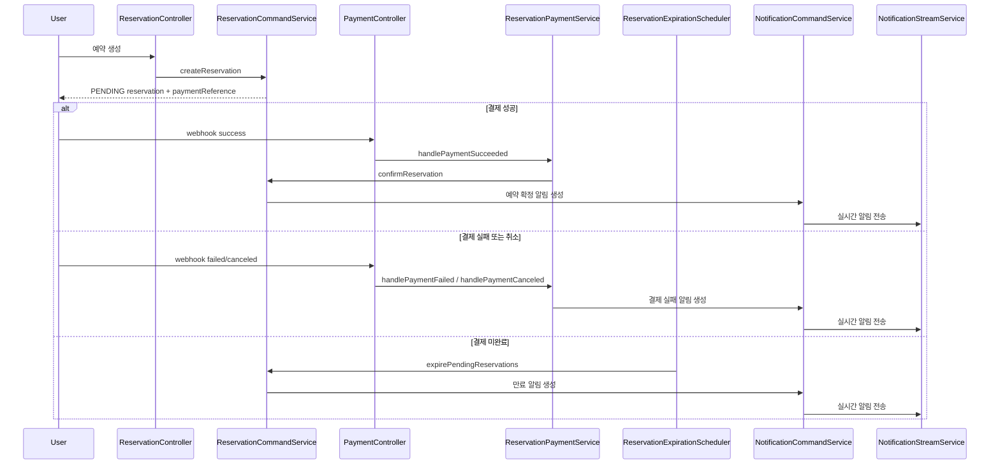

# IdolGlow


<br/>

외국인 이용자를 대상으로 설문조사 기반 개인화 추천을 제공하는 K-pop 뷰티·공연·체험 예약 플랫폼입니다.
핵심은 Kotlin/Spring 기반 백엔드에서 시간 슬롯·수량·좌석 같은 예약 자원을 안전하게 관리하고, 결제 성공/실패/취소/만료에 따라 예약 상태를 일관되게 전이시키는 것입니다.
<br/>

## 프로젝트 목표

- 외국인 사용자의 설문 응답을 기반으로 취향형 상품 탐색과 예약 경험을 제공합니다.
- 예약형 서비스에서 자주 발생하는 상태 전이 문제를 안정적으로 처리합니다.
- OAuth2, JWT, Refresh Token, CORS, 관리자 권한 같은 운영형 보안 이슈를 다룹니다.
- 결제 성공/실패/만료에 따라 예약과 슬롯 상태가 일관되게 변하도록 설계합니다.
- REST와 GraphQL을 함께 제공해 운영 API와 조회 API의 역할을 분리합니다.

## 프로젝트 구성

- `backend`
  - 예약/결제/상태 전이, 인증/인가, 설문/추천, 관리자 운영 API를 담당합니다.
- `frontend`
  - 관리자/운영 화면과 사용자 접점 UI를 담당합니다.

## 핵심 기능

### 사용자와 인증

- OAuth2 로그인
- JWT Access Token / Refresh Token 발급 및 재발급
- Refresh Token CSRF 보호
- 테스트 로그인 지원
- 사용자 설문, 마이페이지, 내 예약/리뷰 조회

### 상품과 옵션

- 상품 생성 및 조회
- 옵션 생성 및 조회
- 태그 기반 상품 탐색
- 예약 슬롯 자동 생성 및 관리자 운영

### 예약과 결제

- 슬롯 기반 예약 생성
- 예약 생성 시 슬롯 hold 처리
- Mock 결제 생성
- 결제 웹훅 성공 시 예약 확정 및 슬롯 book 처리
- 결제 실패/취소 시 예약 취소 및 슬롯 해제
- 시간 초과 시 예약 자동 만료
- 확정 예약의 일정 반영

### 리뷰, 위시, 추천

- 리뷰 작성/수정/삭제
- 위시 토글 및 위시 목록 조회
- 인기 상품 랭킹 API
- 사용자 태그 기반 추천 API

### 알림과 운영

- 예약 확정/취소/결제 실패/만료 SSE 알림
- 관리자용 슬롯 운영 API
- 관리자용 예약 대시보드와 강제 취소 API

### GraphQL

- 상품, 예약, 리뷰 조회
- 예약 생성 mutation
- 예약 취소 mutation
- 위시 토글 mutation
- 리뷰 작성 mutation

## 주요 포인트

### 보안

- Refresh Token 재발급 시 CSRF 검증 추가
- JWT 토큰 타입 claim 추가
- 명시 Origin 기반 CORS 적용
- 관리자 API `ADMIN` 권한 분리

### 예약 무결성

- 예약 생성 시 `PENDING + slot hold`
- 결제 성공 시 `BOOKED + slot book`
- 결제 실패/취소/만료 시 `CANCELED + slot release`
- 스케줄러 기반 자동 만료 처리

### 트랜잭션 안정성

- 이미지 저장/삭제 이벤트를 `AFTER_COMMIT`으로 이동
- 본 트랜잭션 롤백 시 고아 이미지가 생기지 않도록 보강

## 기술 스택

| 구분          | 기술                                                               |
| ------------- | ------------------------------------------------------------------ |
| Language      | Kotlin 2.2.21                                                      |
| JDK           | Java 21                                                            |
| Framework     | Spring Boot 4.0.3                                                  |
| Security      | Spring Security, OAuth2 Client, JWT                                |
| Persistence   | Spring Data JPA, Querydsl, Flyway                                  |
| Database      | H2, MySQL, PostgreSQL                                              |
| API           | REST, Spring GraphQL, Swagger/OpenAPI                              |
| Async / Event | Scheduler, SSE, Async Event                                        |
| Utilities     | Jasypt, WebClient                                                  |
| Test          | Spring Boot Test, Kotest, MockK, RestAssured, Spring Security Test |

## 아키텍처

도메인 중심 패키지 구조와 계층 분리를 사용합니다.

- `global`
  - 보안, 예외 처리, 공통 설정, Resolver
- `user`
  - 인증, OAuth 연동, 사용자, 설문
- `productpackage`
  - 상품, 옵션, 예약, 관리자 운영, 추천/랭킹
- `payment`
  - Mock 결제와 웹훅 처리
- `notification`
  - 알림 저장, SSE 스트림
- `review`
  - 리뷰와 이미지 연결
- `wish`
  - 위시 토글과 목록 조회
- `schedule`
  - 사용자 일정
- `image`
  - 이미지 이벤트 처리

계층 역할은 다음과 같습니다.

- `ui`
  - Controller, Request/Response, GraphQL Resolver
- `application`
  - 유스케이스 조합, 트랜잭션 경계, 상태 전이
- `domain`
  - 엔티티, 값 객체, 비즈니스 규칙
- `infrastructure`
  - JPA Repository, Query Repository, 외부 연동 구현

## 예약-결제-만료-알림 흐름



## REST와 GraphQL을 함께 둔 이유

이 프로젝트에서 REST와 GraphQL은 경쟁 관계가 아니라 역할 분리 관점으로 사용됩니다.

### REST

- 인증
- 웹훅
- 관리자 운영 API
- 파일 업로드
- 행위 중심 API

### GraphQL

- 상품, 예약, 리뷰 조회
- 프론트엔드 친화적인 선택적 필드 조회
- 일부 사용자 mutation 제공

정리하면 `운영과 명령은 REST`, `조회와 화면 조합은 GraphQL`로 나누어 설계했습니다.

## 실행 방법

### 사전 준비

- Java 21
- `ENCRYPT_KEY` 환경 변수

### 로컬 실행

PowerShell 기준:

```powershell
$env:ENCRYPT_KEY="your-encrypt-key"
.\gradlew.bat bootRun
```

기본 프로필은 `local`입니다.

로컬 프로필 특징:

- H2 in-memory DB 사용
- Flyway 활성화
- GraphiQL 활성화
- 테스트 로그인 활성화

### 테스트 실행

```powershell
$env:ENCRYPT_KEY="your-encrypt-key"
.\gradlew.bat test
```

## 로컬에서 확인할 수 있는 엔드포인트

### 문서와 도구

- Swagger UI: `/swagger-ui/index.html`
- OpenAPI JSON: `/v3/api-docs`
- GraphQL: `/graphql`
- GraphiQL: `/graphiql`
- H2 Console: `/h2-console`
- Health Check: `/health/check`

### 주요 REST API

- `GET /products`
- `GET /products/{productId}`
- `POST /products`
- `POST /products/{productId}/reservations`
- `POST /products/{productId}/reservations/{reservationId}/cancel`
- `POST /payments/mock/webhook`
- `GET /products/rankings/popular`
- `GET /products/recommendations`
- `GET /notifications`
- `GET /notifications/stream`
- `GET /admin/reservations/dashboard`
- `POST /admin/reservations/{reservationId}/cancel`

### 주요 GraphQL

#### Query

- `products`
- `product`
- `reservations`
- `upcomingReservations`
- `reservation`
- `productReviews`
- `myReviews`

#### Mutation

- `createReservation`
- `cancelReservation`
- `toggleWish`
- `createProductReview`

## 테스트 로그인

`local`, `dev`, `test` 프로필에서 테스트 로그인을 사용할 수 있습니다.

- `POST /auth/test/signup`
- `POST /auth/test/login`

로그인 시 `X-Test-Auth-Key` 헤더가 필요하며, 값은 `app.auth.test-login.secret` 설정을 따릅니다.

## 환경 변수 예시

로컬 실행 시 최소한 아래 값들을 확인하는 것이 좋습니다.

- `ENCRYPT_KEY`
- `APP_SECURITY_ALLOWED_ORIGINS`
- `MOCK_PAYMENT_WEBHOOK_SECRET`
- `JWT_SECRET`

운영 환경에서는 다음 설정도 함께 관리합니다.

- `APP_AUTH_REFRESH_COOKIE_DOMAIN`
- `RESERVATION_PENDING_TIMEOUT_SECONDS`
- `RESERVATION_EXPIRATION_INTERVAL_MS`
- `NOTIFICATION_SSE_TIMEOUT_MS`
